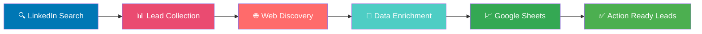
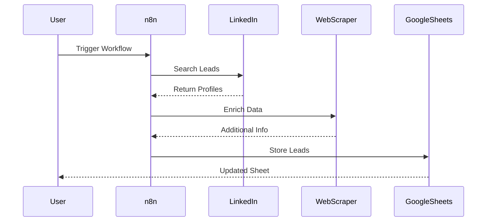

<div align="center">

# 🚀 n8n Secure Lead Intelligence Workflow

### Automated Lead Generation & Company Intelligence Platform

[](https://n8n.io)
[](LICENSE)
[](https://github.com)
[](https://github.com)

<p align="center">
  
  
  
  
</p>

---

**A production-ready, security-first n8n automation workflow for intelligent lead generation and company research. Built for safe GitHub sharing with credential-based architecture and compliance-ready design.**

[🎯 Features](#-features) • [📋 Workflows](#-workflows) • [⚡ Quick Start](#-quick-start) • [🔧 Setup](#-setup-guide) • [📚 Documentation](#-documentation)

</div>

---

## 📖 Overview

This repository contains **two powerful n8n workflows** designed to streamline your B2B lead generation and company intelligence operations. All sensitive credentials have been removed, making it safe for GitHub sharing while maintaining full functionality through n8n's credential management system.

### 🎯 Real Workflow in Action

<div align="center">
  
  <p><i>Actual n8n workflow canvas showing the complete automation flow</i></p>
</div>


### 🎯 How It Works



---

## ✨ Features

<table>
<tr>
<td width="50%">

### 🔒 Security First
- ✅ Zero hardcoded API keys
- ✅ Credential-based architecture
- ✅ Safe for public repositories
- ✅ GDPR/compliance ready

</td>
<td width="50%">

### ⚡ Automation Power
- ✅ LinkedIn lead discovery
- ✅ Automated web scraping
- ✅ Real-time data enrichment
- ✅ Google Sheets integration

</td>
</tr>
<tr>
<td width="50%">

### 🎯 Production Ready
- ✅ Error handling built-in
- ✅ Scalable architecture
- ✅ Modular workflow design
- ✅ Easy customization

</td>
<td width="50%">

### 🚀 Developer Friendly
- ✅ Well-documented nodes
- ✅ JSON workflow exports
- ✅ Import & deploy in minutes
- ✅ Community support ready

</td>
</tr>
</table>

---

## 📋 Workflows

### 1️⃣ Lead Generation Workflow
**`01-lead-generation-workflow.json`**

<div align="center">
  
</div>

> 🎯 **Purpose:** Discover and capture qualified leads from LinkedIn and web sources

**Workflow Components:**
- 🎬 **Trigger**: Manual execution or scheduled runs
- 🔄 **Loop Over Items**: Process multiple leads in batch
- 🌐 **HTTP Requests**: API calls for data enrichment (Apify, Google Serper)
- 💻 **JavaScript Code Nodes**: Custom data transformation and logic
- 📊 **Google Sheets Integration**: Automated data storage and updates
- ♻️ **Replace Me Nodes**: Custom replacement logic for data processing

**Data Flow:**
1. Initialize workflow with search parameters
2. Loop through target companies/individuals
3. Make API calls to gather intelligence
4. Transform and clean data
5. Append results to Google Sheets
6. Handle errors and edge cases

**Ideal For:** SDRs, Sales Teams, Business Development, Marketing Automation

---

### 2️⃣ Company Intelligence Workflow
**`02-company-intelligence-workflow.json`**

> 🧠 **Purpose:** Deep-dive company research and competitive intelligence gathering

**Key Capabilities:**
- 🏢 Company profile enrichment
- 📈 Business metrics collection
- 🔗 Social media intelligence
- 🌍 Web presence analysis
- 📊 Structured data output

**Ideal For:** Market Research, Competitive Analysis, Account-Based Marketing, Due Diligence

---

## ⚡ Quick Start

### Prerequisites

<div align="center">

| Requirement | Version | Purpose |
|------------|---------|---------|
|  | 1.0+ | Workflow execution |
|  | Active | Sheets integration |
|  | Optional | Enhanced scraping |

</div>

### 🚀 Installation

```bash
# 1. Clone the repository
git clone https://github.com/TarunGoel93/n8n-secure-lead-intelligence-workflow.git

# 2. Navigate to workflows directory
cd n8n-secure-lead-intelligence-workflow/workflows

# 3. Import workflows into your n8n instance
# - Open n8n dashboard
# - Click "Import from File"
# - Select workflow JSON files

# 4. Save workflow screenshots (optional)
# - Create 'assets' folder in repository root
# - Take screenshots of your workflows
# - Save as workflow-screenshot.png
```

---

## 🔧 Setup Guide

### Step 1: Configure Credentials

<details>
<summary><b>📝 Click to expand credential setup instructions</b></summary>

#### Required Credentials

1. **Google Sheets API**
   - Navigate to n8n Settings → Credentials
   - Add "Google Sheets OAuth2 API"
   - Follow OAuth flow
   - Grant necessary permissions

2. **LinkedIn Scraper** (Optional)
   - Add scraping service credentials
   - Configure rate limits
   - Set up proxy if needed

3. **Web Scraping Service**
   - Add your preferred scraper API
   - Configure timeout settings
   - Set retry policies

</details>

### Step 2: Customize Workflows

<details>
<summary><b>⚙️ Click to expand customization options</b></summary>

#### Lead Generation Workflow

```javascript
// Example: Customize search criteria
{
  "linkedin_search": {
    "keywords": "YOUR_TARGET_KEYWORDS",
    "location": "YOUR_TARGET_LOCATION",
    "industry": "YOUR_TARGET_INDUSTRY"
  }
}
```

#### Company Intelligence Workflow

```javascript
// Example: Define research parameters
{
  "research_depth": "comprehensive", // or "basic"
  "data_points": ["revenue", "employees", "funding"],
  "sources": ["linkedin", "crunchbase", "company_website"]
}
```

</details>

### Step 3: Test & Deploy

```bash
# 1. Test with sample data
# 2. Verify Google Sheets connection
# 3. Check error handling
# 4. Enable workflow
# 5. Monitor first runs
```

---

## 🏗️ Architecture

### Workflow Structure

```
n8n-secure-lead-intelligence-workflow/
│
├── workflows/
│   ├── 01-lead-generation-workflow.json      # Core lead discovery
│   └── 02-company-intelligence-workflow.json # Company research
│
├── assets/                                     # Workflow screenshots
│   ├── workflow-screenshot.png
│   └── lead-generation-workflow.png
│
├── docs/                                       # (Optional) Documentation
│   ├── setup-guide.md
│   └── api-reference.md
│
└── README.md                                   # This file
```

### Node Types Used

| Node Type | Purpose | Count |
|-----------|---------|-------|
| 🎬 Manual Trigger | Workflow initiation | 1 |
| 🔄 Loop | Batch processing | 2 |
| 🌐 HTTP Request | API integrations | 4 |
| 💻 JavaScript Code | Data transformation | 6 |
| 📊 Google Sheets | Data storage | 4 |
| 🔄 Replace Me | Custom logic | 2 |

---

## 📊 Workflow Visualization

### Lead Generation Flow



---

## 🛡️ Security Features

<div align="center">

| Feature | Implementation | Status |
|---------|---------------|--------|
| 🔐 API Key Management | n8n Credentials Store | ✅ Active |
| 🔒 Encrypted Storage | Built-in Encryption | ✅ Active |
| 🚫 No Hardcoded Secrets | Credential References | ✅ Active |
| ✅ Audit Logging | Execution History | ✅ Active |
| 🛡️ Rate Limiting | Configurable Delays | ✅ Active |

</div>

### Best Practices

- ✅ **Never commit credentials** to version control
- ✅ **Use environment-specific** credential sets
- ✅ **Enable execution logging** for audit trails
- ✅ **Implement rate limiting** to avoid API bans
- ✅ **Regular credential rotation** for enhanced security

---

## 🎨 Customization Options

### Lead Scoring Rules

```javascript
// Customize lead qualification criteria
const leadScoring = {
  companySize: {
    "1-10": 1,
    "11-50": 2,
    "51-200": 3,
    "201+": 4
  },
  jobTitle: {
    "C-Level": 5,
    "VP": 4,
    "Director": 3,
    "Manager": 2
  }
};
```

### Output Formatting

Configure how data appears in Google Sheets:
- Column mappings
- Data transformations
- Conditional formatting
- Auto-categorization

---

## 📈 Use Cases

<table>
<tr>
<td align="center" width="25%">
<br>
<b>B2B Lead Generation</b><br>
Identify decision-makers<br>
Build targeted lists<br>
Automate outreach prep
</td>
<td align="center" width="25%">
<br>
<b>Market Intelligence</b><br>
Competitor analysis<br>
Industry trends<br>
Market sizing
</td>
<td align="center" width="25%">
<br>
<b>Account-Based Marketing</b><br>
Target account research<br>
Personalization data<br>
Engagement insights
</td>
<td align="center" width="25%">
<br>
<b>Investment Research</b><br>
Company profiles<br>
Financial metrics<br>
Growth indicators
</td>
</tr>
</table>

---

## 🤝 Contributing

We welcome contributions! Here's how you can help:

1. 🍴 **Fork** the repository
2. 🌿 **Create** a feature branch (`git checkout -b feature/AmazingFeature`)
3. 💾 **Commit** your changes (`git commit -m 'Add some AmazingFeature'`)
4. 📤 **Push** to the branch (`git push origin feature/AmazingFeature`)
5. 🎉 **Open** a Pull Request

### Contribution Guidelines

- ✅ Maintain security-first approach
- ✅ Document all changes
- ✅ Test thoroughly before submitting
- ✅ Follow existing code style
- ✅ No credentials in commits

---

## 📚 Documentation

- 📘 [n8n Official Docs](https://docs.n8n.io/)
- 📗 [Workflow Templates](https://n8n.io/workflows/)
- 📙 [API Integration Guide](https://docs.n8n.io/integrations/)
- 📕 [Security Best Practices](https://docs.n8n.io/hosting/security/)

---

## 🆘 Support & Community

<div align="center">

[](https://github.com/TarunGoel93/n8n-secure-lead-intelligence-workflow/issues)
[](https://community.n8n.io/)
[](https://discord.gg/n8n)

</div>

### Need Help?

- 🐛 **Found a bug?** [Open an issue](https://github.com/TarunGoel93/n8n-secure-lead-intelligence-workflow/issues)
- 💡 **Have a feature request?** [Start a discussion](https://github.com/TarunGoel93/n8n-secure-lead-intelligence-workflow/discussions)
- 📧 **Need direct support?** Contact the maintainer

---

## 📜 License

This project is licensed under the **MIT License** - see the [LICENSE](LICENSE) file for details.

```
MIT License - Free to use, modify, and distribute
Provided "as-is" without warranty
Attribution appreciated but not required
```

---

## 🙏 Acknowledgments

- 🎉 **n8n Team** - For the amazing automation platform
- 🌟 **Community Contributors** - For inspiration and feedback
- 💼 **Sales & Marketing Professionals** - For use case validation

---

## 🔄 Changelog

### v1.0.0 - Initial Release
- ✅ Lead generation workflow
- ✅ Company intelligence workflow
- ✅ Google Sheets integration
- ✅ Security-first architecture
- ✅ Complete documentation

---

<div align="center">

### 🌟 Star this repo if you find it useful!

[](https://github.com/TarunGoel93/n8n-secure-lead-intelligence-workflow/stargazers)
[](https://github.com/TarunGoel93/n8n-secure-lead-intelligence-workflow/network/members)
[](https://github.com/TarunGoel93/n8n-secure-lead-intelligence-workflow/watchers)

---

**Made with ❤️ by [Tarun Goel](https://github.com/TarunGoel93)**

*Automate intelligently. Scale effortlessly. Generate leads continuously.*

---


</div>
